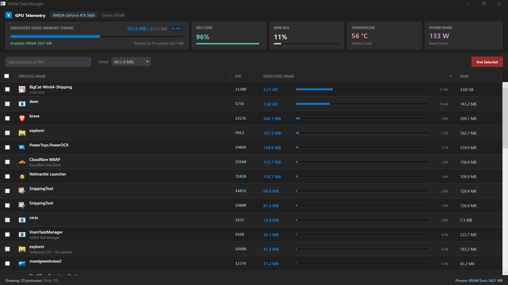

# VRAM Task Manager

VRAM Task Manager is a dedicated, high-performance Windows desktop application developed in C# and .NET 8 (WPF). It provides real-time hardware telemetry and granular, per-process Dedicated Video RAM (VRAM) monitoring and memory reclamation for NVIDIA GPU architectures.

---

## Interface Preview



---

## Key Features

- **Real-Time Hardware Telemetry**: Live metric polling via native NVIDIA Management Library (NVML) for GPU Core utilization, Memory Controller bus load, GPU temperature, and board power consumption.
- **Per-Process Dedicated VRAM Tracking**: Low-latency inspection of dedicated video memory across active process instances using Windows Performance Counters (PDH).
- **Process Classification & Metadata Extraction**: Automatic process categorization (User Applications, Web Browsers, Background Services, and System Core components) with application icon resolution and working set RAM tracking.
- **Process Termination & VRAM Reclamation**:
  - Direct single-process termination with real-time memory buffer release.
  - Multi-select batch process termination for reclaiming bulk VRAM allocations.
  - Context menu actions including Open File Location and Copy Process Details.
- **Integrated Administrator Elevation (UAC)**: On-demand Windows User Account Control elevation for terminating protected or elevated process trees.
- **Lag-Free Differential UI Engine**: In-place collection synchronization and metadata caching to ensure smooth 60+ FPS window manipulation and background updates without layout thrashing.

---

## Architecture & Implementation

### 1. Hardware Telemetry Pipeline (NVML)
The application establishes direct P/Invoke bindings to `nvml.dll` (`nvmlInit_v2`, `nvmlDeviceGetHandleByIndex_v2`, `nvmlDeviceGetMemoryInfo`, `nvmlDeviceGetUtilizationRates`, `nvmlDeviceGetTemperature`, `nvmlDeviceGetPowerUsage`) to poll global GPU memory and board metrics directly from the display driver.

### 2. Process Memory Inspection (PDH)
Per-process video memory is extracted via bulk category reads (`_gpuCategory.ReadCategory()`) targeting `\GPU Process Memory(*)\Dedicated Usage`. This captures memory held across DirectX, Vulkan, OpenGL, CUDA, and Desktop Window Manager (DWM) contexts with minimal CPU overhead.

### 3. In-Place Differential Synchronization
To prevent UI thread hitches during rapid background sampling, `MainViewModel` employs an in-place diffing algorithm on the `ObservableCollection`. Existing rows receive atomic property updates rather than full collection clears, eliminating WPF DataGrid visual tree reconstructions.

---

## Distribution & Packaging

The application is distributed in two self-contained formats targeting 64-bit Windows (`win-x64`), requiring zero external dependencies or pre-installed .NET SDKs:

| Package Type | File | Description |
| :--- | :--- | :--- |
| **Setup Installer** | `VramTaskManager_Setup_v0.1.0_x64.exe` | Inno Setup wizard with desktop and Start Menu shortcuts, uninstaller, and automated .NET runtime verification. |
| **Portable Archive** | `VramTaskManager_Portable_v0.1.0_x64.zip` | Standalone archive containing all runtime binaries. Extract and run `VramTaskManager.exe` directly. |

---

## Project Structure

```
VramTaskManager/
├── .github/
│   └── workflows/
│       └── build-and-release.yml    # GitHub Actions CI/CD pipeline
├── assets/
│   └── image.png                    # Application interface preview
├── Converters/
│   └── CommonConverters.cs          # WPF data converters (colors, visibility, formatting)
├── installer/
│   ├── VramTaskManager_Setup.iss    # Inno Setup 6 compilation script
│   └── output/                      # Generated release artifacts
├── Models/
│   ├── GpuTelemetry.cs              # Hardware telemetry data model
│   └── ProcessVramItem.cs           # Observable process item model
├── Native/
│   └── NvmlNative.cs                # Win32 and NVML P/Invoke bindings
├── Services/
│   ├── GpuMonitoringService.cs       # Telemetry polling & process memory aggregation
│   ├── IconHelper.cs                # Process executable icon resolution & caching
│   ├── ProcessManagerService.cs     # Classification, termination, and UAC elevation
│   └── ProcessPathHelper.cs         # Win32 QueryFullProcessImageName path resolver
├── ViewModels/
│   └── MainViewModel.cs             # MVVM state management & reactive command bindings
├── App.xaml                         # Global styles & theme templates
├── App.xaml.cs                      # Application entry point
├── MainWindow.xaml                  # Dashboard layout, telemetry cards, and DataGrid
├── MainWindow.xaml.cs               # DWM dark title bar initialization
└── VramTaskManager.csproj           # .NET 8 WPF project configuration (win-x64 self-contained)
```

---

## Building from Source

### Prerequisites
- Windows 10 (Build 17763 or later) / Windows 11 (64-bit)
- .NET 8.0 SDK (or later)
- NVIDIA GPU with driver supporting NVML (version 450.xx or higher)
- Inno Setup 6 (optional, required only for building setup installers locally)

### Build Commands

1. **Restore and Build (Debug)**:
   ```powershell
   dotnet build VramTaskManager.csproj -c Debug
   ```

2. **Publish Self-Contained Release**:
   ```powershell
   dotnet publish VramTaskManager.csproj -c Release -r win-x64 --self-contained true -o ./publish /p:PublishSingleFile=false /p:IncludeNativeLibrariesForSelfExtract=true
   ```

3. **Compile Setup Installer (Optional)**:
   ```powershell
   & "C:\Program Files (x86)\Inno Setup 6\ISCC.exe" installer/VramTaskManager_Setup.iss
   ```

4. **Create Portable ZIP Archive**:
   ```powershell
   Compress-Archive -Path ./publish/* -DestinationPath ./installer/output/VramTaskManager_Portable_v0.1.0_x64.zip -Force
   ```

---

## Continuous Integration & Deployment

The repository includes a GitHub Actions CI/CD workflow (`.github/workflows/build-and-release.yml`) that automates:
1. Compilation of the self-contained `win-x64` payload.
2. Inno Setup installer compilation with LZMA2 ultra compression.
3. Creation of the standalone portable ZIP archive.
4. Publication of GitHub Releases upon pushing version tags (`v*`).

---

## System Requirements

- **Operating System**: Windows 10 (Version 1809 / Build 17763 or higher), Windows 11 (64-bit).
- **GPU Architecture**: NVIDIA GeForce, Quadro, RTX, or GTX graphics card with NVML display driver support.
- **Hardware Architecture**: x64 (AMD64).
